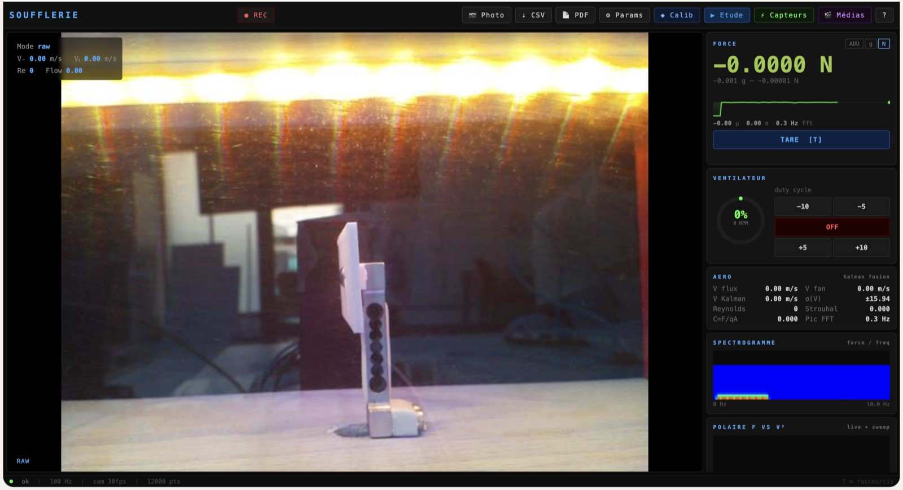
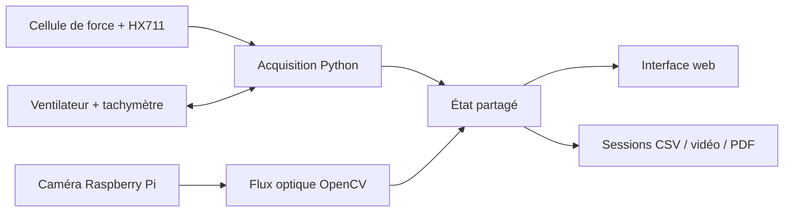

# Soufflerie pédagogique

Petite soufflerie réalisée en équipe à l'ENSAM. Je me suis occupé du logiciel : un Raspberry Pi
pilote le ventilateur, mesure la force sur la maquette, filme l'écoulement et sert une interface
web qu'on ouvre depuis n'importe quel téléphone ou ordinateur.

**Projet en cours.** Le banc tourne et enregistre des essais, mais la vitesse d'air et la force ne
sont pas encore calibrées par rapport à une mesure de référence : les valeurs affichées sont des
estimations.



*L'interface, ventilateur à l'arrêt : image caméra à gauche ; force, ventilateur, grandeurs
aérodynamiques et spectrogramme à droite.*

## Équipe

- **Ugo** : conception mécanique
- **Thadeo** : électronique
- **Hugo Prigent** : logiciel et acquisition de données

## Ce que fait le logiciel

- **Ventilateur** : commande PWM à 25 kHz, lecture du régime par le tachymètre, balayages
  automatiques de consigne.
- **Force** : cellule de charge et HX711 lus à 20 Hz, avec tare, moyenne glissante et calibration
  depuis l'interface.
- **Image** : flux optique OpenCV (Farneback) sur la fumée pour estimer le mouvement de l'air ;
  réglages caméra, zone d'intérêt et calibration pixels/mètre.
- **Vitesse d'air** : deux estimations, l'une tirée du régime ventilateur (fiche technique et
  rapport de contraction de la veine), l'autre de l'image, fusionnées par un filtre de Kalman.
- **Grandeurs dérivées** : nombre de Reynolds, Strouhal, coefficient F/(qA), spectre de la force
  (FFT), variance d'Allan pour le bruit du capteur.
- **Enregistrement** : sessions en CSV avec leurs métadonnées de calibration, vidéo, export JSON et
  rapport PDF.
- **Autres capteurs** : pression BMP280 et bouton Modulino sur le bus I²C, bandeau LED.
- **Réseau** : le Pi peut créer son propre point d'accès Wi-Fi ; l'interface est alors sur
  `http://192.168.8.1:8080`.



## Contenu du dépôt

| Chemin | Rôle |
| --- | --- |
| `software/dashboard.py` | Serveur HTTP, interface web et boucles d'acquisition |
| `software/config.py` | Câblage (GPIO, I²C), géométrie de la veine, calibrations par défaut |
| `software/src/` | Ventilateur, capteurs, traitement d'image, analyse |
| `examples/session-2026-05-28.csv` | Un export de session réel : 12 000 mesures à 20 Hz |

## Lancer sur le Raspberry Pi

Il faut un Raspberry Pi OS avec une caméra compatible Picamera2 et le matériel câblé comme dans
`software/config.py`.

```bash
cd software
pip install -r requirements.txt
python3 dashboard.py
```

Puis ouvrir `http://<adresse-du-pi>:8080`. Les enregistrements vont dans `software/data/`
(modifiable avec la variable `SOUFFLERIE_DATA_DIR`). L'interface n'a pas d'authentification et
commande du matériel : elle est faite pour le réseau local du banc.

## Le fichier d'exemple

Les lignes qui commencent par `#` donnent la calibration utilisée pendant l'essai (offset et gain
du HX711, dimensions de la maquette, masse volumique de l'air…). Colonnes :

| Colonne | Contenu |
| --- | --- |
| `t_s` | Temps en secondes |
| `duty_pct` | Consigne PWM du ventilateur (%) |
| `fan_rpm` | Régime mesuré |
| `delta_adu`, `force_g`, `force_N` | Force brute puis convertie |
| `flow_mag_px` | Amplitude du flux optique |
| `airspeed_flow_ms`, `airspeed_fan_ms` | Vitesse d'air estimée par l'image et par le ventilateur |

## Prochaines étapes

- Calibrer la vitesse d'air avec un anémomètre et la force avec des masses étalons.
- Sortir l'interface HTML de `dashboard.py`, qui fait aujourd'hui plus de 7 000 lignes.
- Ajouter un mode de relecture pour rejouer une session sans le banc.
