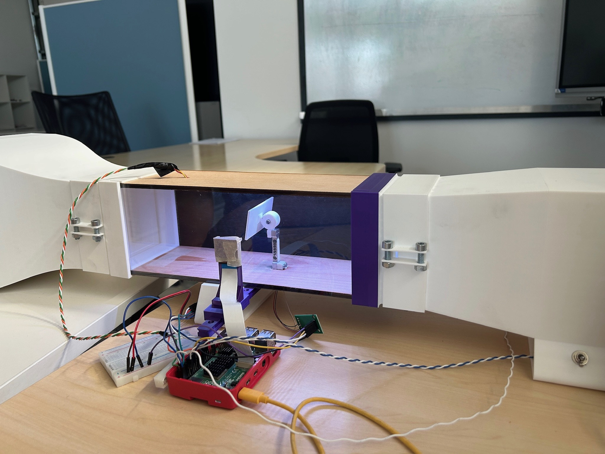
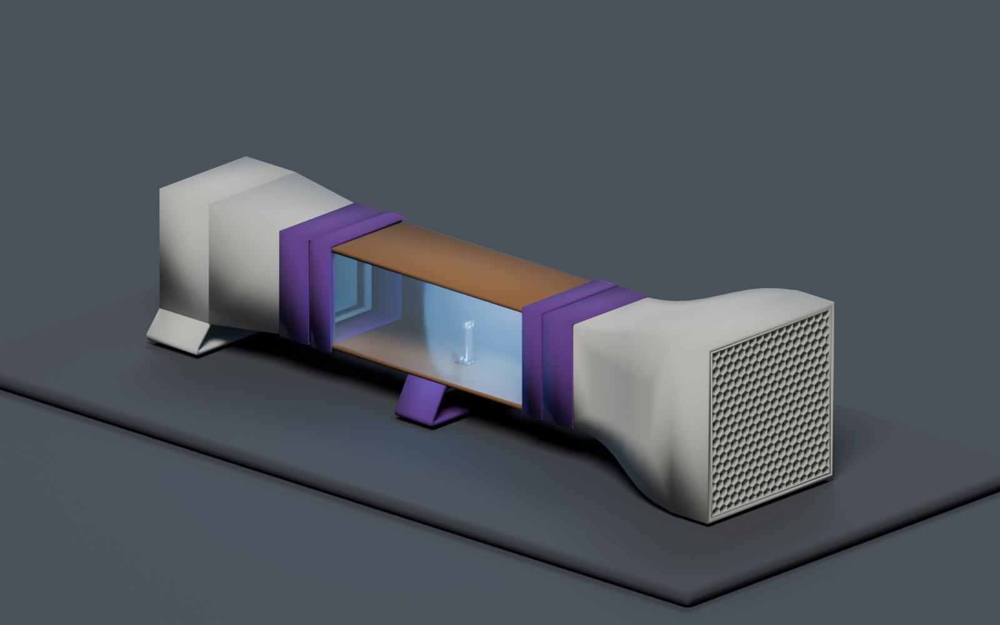
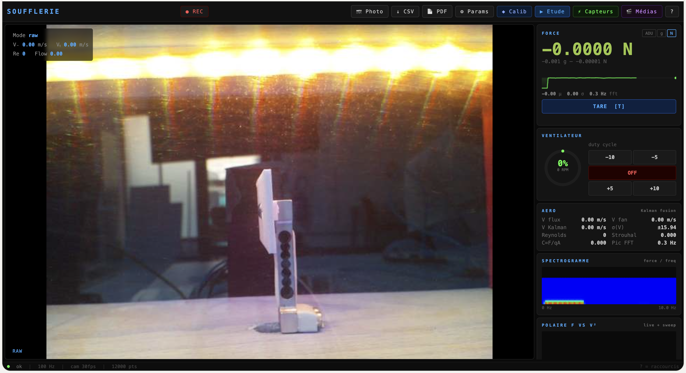

# Soufflerie pédagogique — ENSAM, 2026

Cette soufflerie de table permet d'observer l'écoulement autour d'une maquette et d'étudier la commande du ventilateur, la mesure de force et l'acquisition vidéo sur Raspberry Pi. Le dépôt contient les modèles 3D, le logiciel et la documentation du banc.

*La soufflerie avec sa section d'essai et son instrumentation.*

*Modèle 3D de la soufflerie : conduits, section d'essai et supports.*

## Vidéo de présentation

[Voir la soufflerie en vidéo sur YouTube](https://youtu.be/92m-7GADWI4).

## Le projet en bref

| Domaine | Ce qui est disponible |
| --- | --- |
| Mécanique | [Modèle 3D de la soufflerie](cad/assemblage-onshape.step), [23 modèles 3D des pièces](cad/step/), [modèle Blender](cad/rendu-assemblage.blend) et [guide de fabrication](cad/README.md) |
| Électronique | Raspberry Pi, ventilateur, cellule de charge et caméra ; [schéma de câblage](docs/schema-cablage.svg) et [documentation électronique](docs/electronique-cablage.md) |
| Logiciel | [Supervision Python](software/) : PWM et tachymètre, acquisition de force, caméra et traitement d'image, interface HTTP et export CSV |
| Données | [Un export de session](examples/session-2026-05-28.csv) avec [explication des colonnes et limites](docs/donnees-et-limites.md) |

Le banc comporte une section d'essai visible entre un convergent et un diffuseur. La maquette se place dans la veine ; la chaîne de force passe par une cellule de charge et le convertisseur HX711. Le tableau de bord affiche les signaux et permet la commande et l'enregistrement. La caméra sert à la visualisation et à un traitement de flux optique. Les valeurs de vitesse et les coefficients dérivés exigent une calibration indépendante avant toute interprétation quantitative.

*Capture du 28 mai 2026 : le ventilateur est à l'arrêt sur cette image.*

## Parcourir le dépôt

- [Reproduire le projet](docs/reproduire-le-projet.md) : fichiers 3D, nomenclature de reprise, ordre de fabrication, montage et points à relever sur le prototype.
- [CAO et fabrication](cad/README.md) : modèles de l'ensemble et des pièces, repères pour la fabrication.
- [Mécanique et assemblage](docs/mecanique-fabrication.md) : sous-ensembles visibles, ordre de montage proposé et vérifications avant fabrication.
- [Électronique et câblage](docs/electronique-cablage.md) : composants, connexions et broches du Raspberry Pi.
- [Installation et utilisation](docs/installation-utilisation.md) : environnement Raspberry Pi, lancement, accès local et sécurité réseau.
- [Données et limites](docs/donnees-et-limites.md) : ce que l'export permet d'examiner et ce qu'il ne valide pas.
- [Vérifications et compléments](docs/publication.md) : licence, câblage réel et validation matérielle.

## Calibration et accès

La vitesse d'air et les coefficients aérodynamiques affichés nécessitent un étalonnage indépendant.

Le serveur écoute par défaut sur `127.0.0.1:8080`. L'accès depuis un autre appareil doit être activé explicitement et limité à un réseau maîtrisé : l'application ne comporte pas d'authentification. Voir le [guide d'utilisation](docs/installation-utilisation.md).

## Réutilisation

Aucune licence de réutilisation n'est encore attribuée au code, à la documentation, aux photos ou aux modèles 3D. L'absence de fichier de licence ne vaut pas autorisation de réutilisation.
