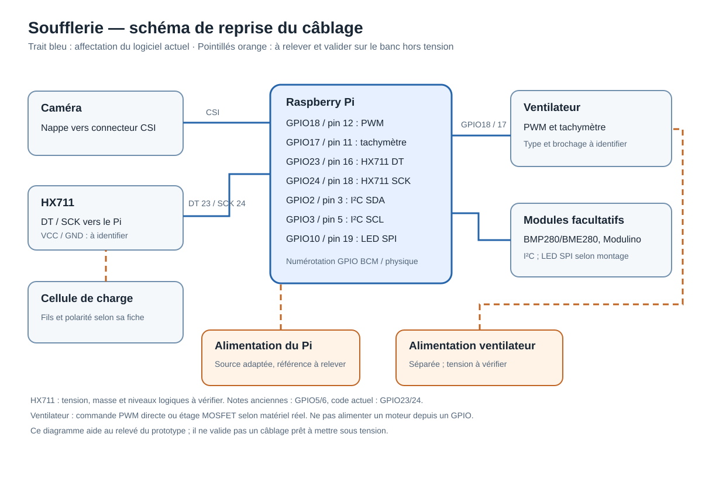
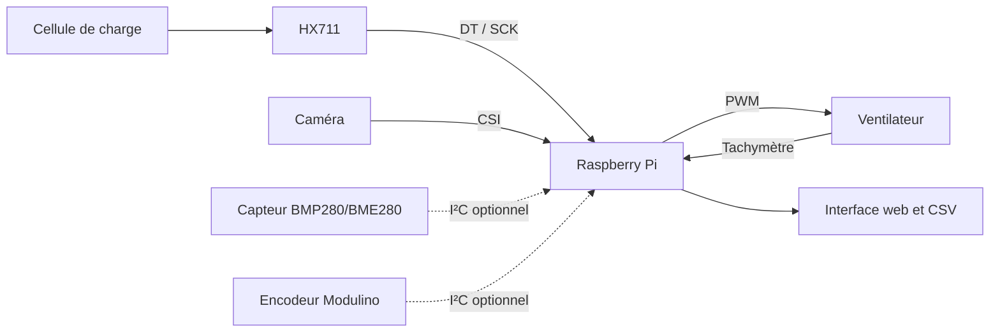

# Électronique et câblage

Le [schéma de reprise en SVG](schema-cablage.svg) accompagne le relevé du prototype. Les traits pleins montrent les affectations déclarées par le code ; les pointillés signalent les alimentations et connexions à confirmer avant de construire un circuit. Il ne constitue pas un schéma de mise sous tension validé.

## Chaîne fonctionnelle

Le logiciel actuel utilise directement les GPIO pour lire le HX711 et commander le ventilateur. Il prévoit également un bus I²C et un ruban LED SPI. La présence et le branchement effectifs de tous les modules optionnels n'ont pas été revérifiés.

## Broches déclarées par le code actuel

| Fonction | GPIO BCM | Broche physique Raspberry Pi | Source |
| --- | ---: | ---: | --- |
| PWM ventilateur | 18 | 12 | `software/config.py` |
| Tachymètre ventilateur | 17 | 11 | `software/config.py` |
| HX711 DT | 23 | 16 | `software/config.py` |
| HX711 SCK | 24 | 18 | `software/config.py` |
| I²C SDA / SCL | 2 / 3 | 3 / 5 | Bus Raspberry Pi, modules I²C du code |
| Ruban LED SPI | 10 | 19 | `software/src/led_control.py` |

**Divergence importante :** des notes et rapports historiques placent HX711 DT/SCK sur GPIO5/6, tandis que le code courant et une note de connexions plus récente indiquent GPIO23/24. Une ancienne note demande une alimentation HX711 à 3,3 V ; une autre à 5 V pour un module supposé régulé. Le type exact de carte HX711 et le câblage réel ne sont pas établis par les sources disponibles. **Ne brancher le module ni à 3,3 V ni à 5 V d'après ce seul document.** Vérifier la référence, le schéma ou la sérigraphie de la carte et les niveaux logiques avant mise sous tension, puis aligner `config.py` sur le banc.

## Alimentations et interfaces à contrôler

- Le ventilateur a une alimentation distincte de celle du Raspberry Pi. Confirmer sa tension et son brochage sur la référence réellement montée. Ne pas alimenter le moteur depuis un GPIO.
- Les notes diffèrent sur l'étage de commande : PWM direct d'un ventilateur à quatre fils dans la note récente, MOSFET dans des documents plus anciens. Identifier le ventilateur et le montage présents avant de reproduire le circuit.
- Vérifier la masse de référence commune des signaux de commande, les niveaux d'entrée du tachymètre et l'état du ventilateur en cas de perte de PWM.
- La caméra se connecte à l'interface CSI du Pi ; l'orientation de la nappe doit être vérifiée sur les connecteurs effectivement utilisés.
- Les modules BMP280/BME280 et Modulino sont prévus sur le bus I²C ; vérifier leurs adresses et leur présence. Le capteur de pression seul ne suffit pas à établir une vitesse locale validée.

Aucun schéma historique n'est présenté comme plan de câblage définitif : certains portent GPIO5/6 et des hypothèses d'alimentation incompatibles avec les notes plus récentes. Le prochain contrôle utile est une photo nette de chaque carte, de ses fils et de l'en-tête GPIO, suivie d'un relevé point à point hors tension.
